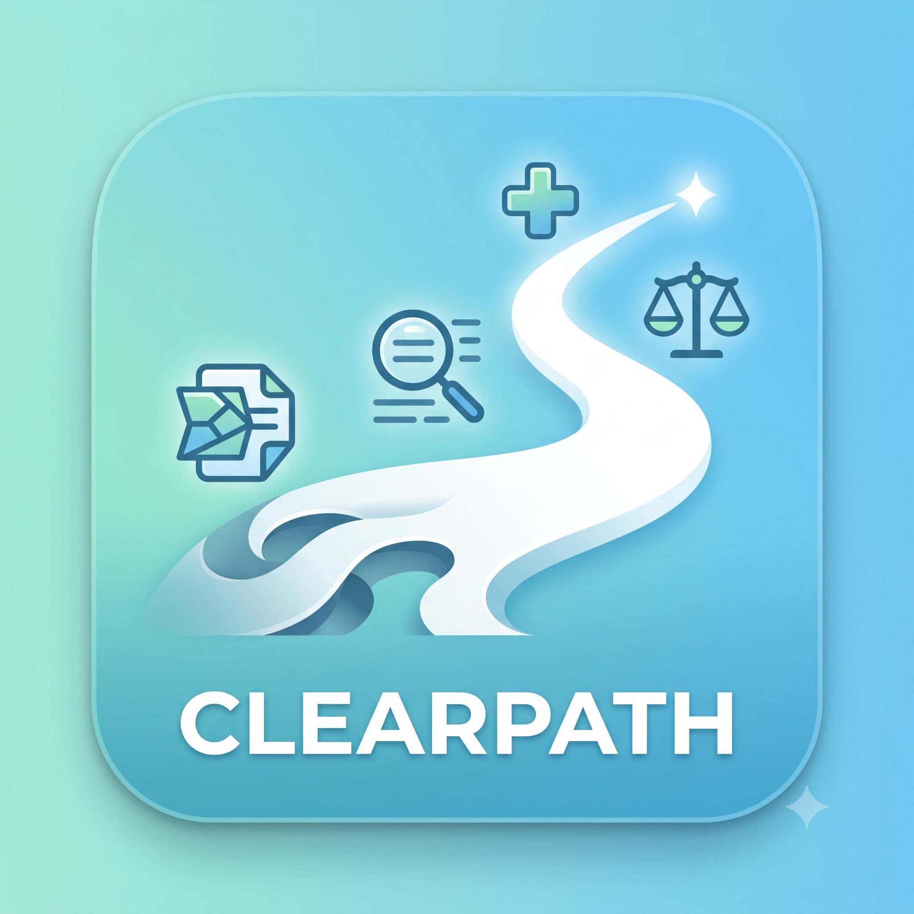

# ClearPath

**Understand your health and rights in seconds.**

ClearPath is a kiosk-style web application that translates complex medical and legal documents into plain English. Upload a PDF, get a summary, action steps, and a glossary — in under a second, powered by Groq AI.



## Features

- **Kiosk UI** — full-screen application with navigable panels (Home, Upload, Analysis, Results, History, Help)
- **Real PDF processing** — server-side text extraction via `unpdf`, then AI analysis
- **Structured output** — summary (ELI5), 3 action items with checkboxes, expandable glossary
- **Streaming results** — real-time UI updates via Vercel AI SDK `streamObject`
- **EU-ready** — English interface, accessibility-focused design, institutional light theme
- **Zero-cost stack** — Groq free tier + Vercel free tier

## Tech Stack

| Layer | Technology |
|-------|-----------|
| Framework | Next.js 16, React 19, TypeScript |
| Styling | Tailwind CSS v4, shadcn/ui, Plus Jakarta Sans |
| AI | Groq API (`openai/gpt-oss-120b`), Vercel AI SDK |
| PDF | unpdf |
| Validation | Zod |
| Deploy | Vercel |

## Getting Started

### Prerequisites

- Node.js 20+
- A free [Groq API key](https://console.groq.com/)

### Setup

```bash
git clone <your-repo-url>
cd ClearPath
npm install
```

Create `.env.local`:

```env
GROQ_API_KEY=your_groq_api_key_here
```

Run the development server:

```bash
npm run dev
```

Open [http://localhost:3000](http://localhost:3000).

### Try it

1. Go to **Upload** and select a text-based PDF or `.txt` file
2. Wait for text extraction and AI analysis
3. Review **Summary**, **What you need to do**, and **Glossary** in Results
4. Check **History** for past sessions in the current browser session

> **Note:** Scanned/image-only PDFs are not supported yet — the document must contain extractable text.

## Project Structure

```
app/
  api/
    analyze/     # Groq AI streaming endpoint
    extract/     # PDF/text extraction endpoint
  page.tsx       # Kiosk app entry point
components/
  kiosk/         # App shell, panels, navigation
  ui/            # shadcn/ui components
lib/
  groq.ts        # Groq client config
  analysis-schema.ts
  extract-document.ts
```

## API Routes

### `POST /api/extract`

Accepts `multipart/form-data` with a `file` field. Returns extracted plain text.

### `POST /api/analyze`

Accepts `{ "text": "..." }`. Returns a streamed JSON object:

```json
{
  "summary": "Two plain-English sentences.",
  "action_items": ["Step 1", "Step 2", "Step 3"],
  "difficult_words": [
    { "word": "hyperlipidemia", "definition": "High cholesterol in the blood." }
  ]
}
```

## Deploy on Vercel

1. Push the repo to GitHub
2. Import the project on [Vercel](https://vercel.com/new)
3. Add environment variable: `GROQ_API_KEY`
4. Deploy

## Authors

- **Kamil Piejko** — full stack
- **Joanna Pich** — flow and logic
- **Dominika Zięba** — UI

## License

See [LICENSE](./LICENSE).
